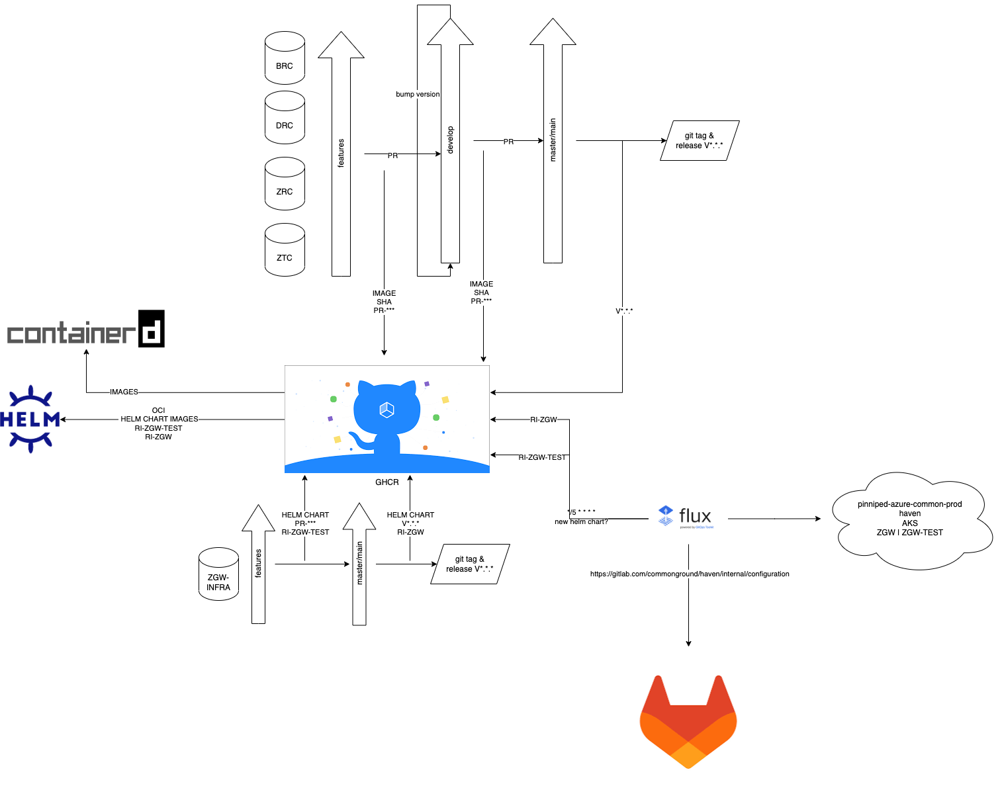

# Release Proces DRAFT

## Stappen

1. Merge alle Pull Requests die bij de release horen naar `develop`. Controleer de volgende repo's:
   1. zaken-api
   2. catalogi-api
   3. documenten-api
   4. besluiten-api
2. Zorg ervoor dat je je branch verwijdert na de merge. Dit gebeurt niet meer automatisch zodat we niet elke keer onze `develop` of `master` branch verwijderen.
3. Wanneer alle code naar `develop` is gemerged `pull` je de laatste changes van develop en maak je een `bump` branch
   + `bump/v*.*.*` naar develop.
4. Op deze branch maak je de benodigde wijzingen voor een productie release:
   + versies in files verhogen met de versie (search and replace) `.bumpversion.cfg` geeft per repo aan welke dat zijn
     + bijvoorbeeld: `readme.rst` `package.json` `config/api.py` `src/api/__init__.py`
   + `generate_schema` vanuit de root in een terminal draaien (dit maakt de juiste `openapi.yaml` versie)
   + root README.rst aanpassen:
     + kopje `API specificaties` moet een nieuwe regel komen met de versie die gereleased gaat worden bijvoorbeeld:
```markdown
1.3.0       2023-08-22      `ReDoc <https://redocly.github.io/redoc/?url=https://raw.githubusercontent.com/VNG-Realisatie/catalogi-api/1.3.0/src/openapi.yaml>`_,                                                                 `Scopes <https://github.com/VNG-Realisatie/catalogi-api/blob/1.3.0/src/autorisaties.md>`_                                `Berichtkenmerken <https://github.com/VNG-Realisatie/catalogi-api/blob/1.3.0/src/notificaties.md>`_
                            `Swagger <https://petstore.swagger.io/?url=https://raw.githubusercontent.com/VNG-Realisatie/catalogi-api/1.3.0/src/openapi.yaml>`_
```
   + `CHANGELOG.RST` aanvullen met de laatste aanpassingen, houdt het format aan zoals bij andere staat.
5. Merge de `bump/v*.*.*` naar develop
6. Maak een merge request van `develop` naar `master`/`main` met titel: `Production release to version v*.*.*`
7. Na een approval kun je deze branch naar `master`/`main` mergen. Let op dat je de develop branch niet verwijdert.
8. Maak nu een release aan vanaf master via de github UI (1.0.2). Het is beter om de versie zonder v op te nemen of 2 releaes te maken met en zonder v. Hiermee zorg je ervoor dat de links naar redoc blijven werken.
9. Hierna wordt een productie image gebouwd. Je kunt dit via `packages` controleren. Als de nieuwe versie er staat ga dan naar de volgende stap.
10. Maak een branch voor de release aan in `zgw-infra` en pas de images in `./parser/env.yaml` aan. Doe dit voor `productie` `test` en `local`
11. Maak een PR aan voor deze branch maar `main` (`zgw-infra`)
12. Na goedkeuren wordt er een test helm chart gepushed en gedeployed op de test omgeving. Hier kun je de POSTMAN tests tegenaan draaien om te controleren dat alles goed is gegaan.
13. Wanneer alles op main staat kun je een release maken voor de helm chart (dit kan via de github UI) en deze wordt dan automatisch gedeployed

## Proces


